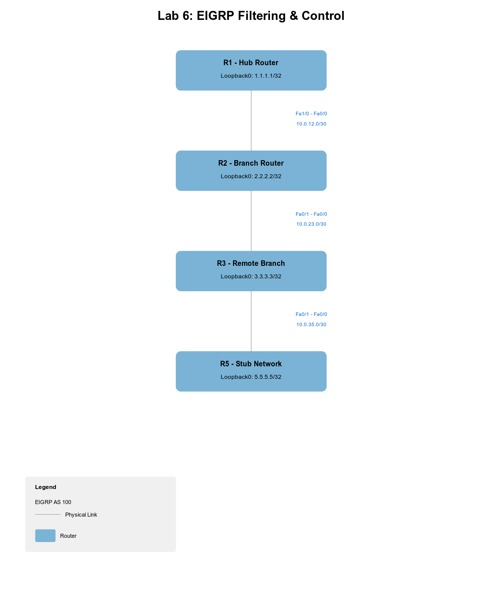

# EIGRP Lab 06: Filtering & Control

## Topology

## Objectives
- Implement route filtering using distribute-lists and prefix-lists.
- Utilize route-maps for advanced traffic engineering.
- Verify filtering effects on the routing table.

Refer to [workbook.md](./workbook.md) for full instructions.
